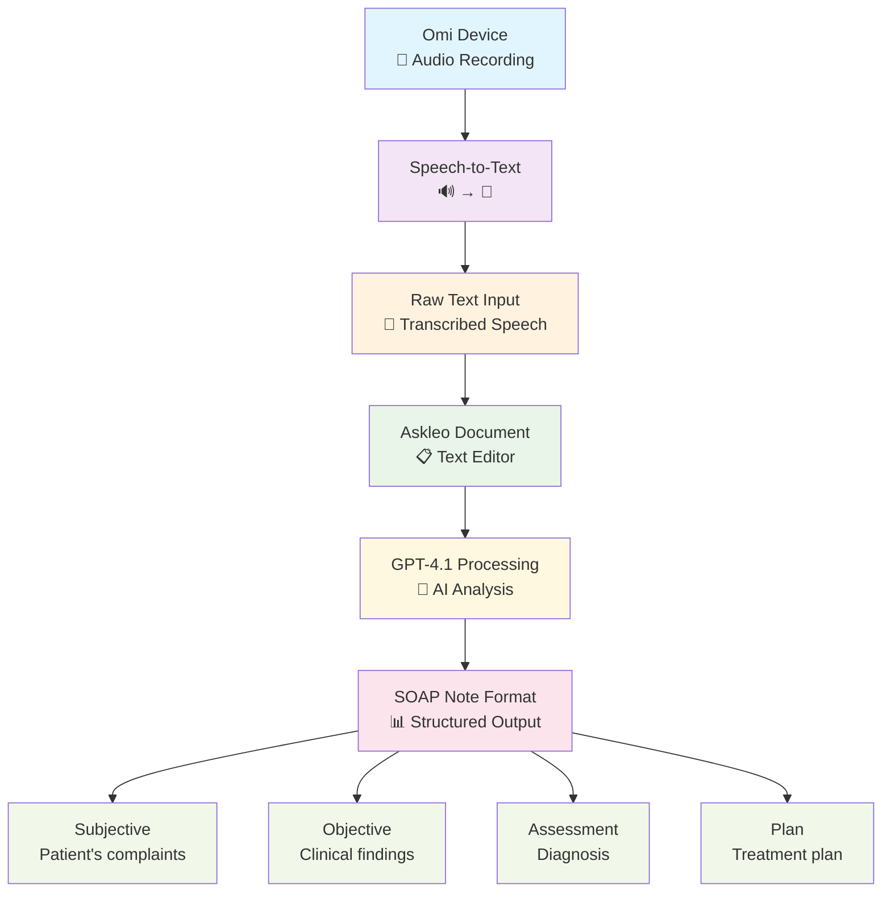

# Askleo - AI-Powered Medical Documentation Assistant

**Named after Asclepius, the Greek god of healing**

Askleo is an intelligent medical writing assistant designed to solve one of the biggest pain points in healthcare: writing accurate, efficient medical documentation like SOAP notes and other clinical documents.

## 🏥 The Problem

Medical professionals waste countless hours writing documentation when they could be focusing on patient care. Traditional medical note-taking:
- Slows down clinical workflows
- Requires mastering complex shorthand systems
- Often leads to incomplete or inaccurate documentation
- Takes time away from life-saving activities

As the creator experienced during mass casualty coordination: "I always felt like note taking always slowed me down... I genuinely believe I could have saved more lives at a 1.5x increased rate" with better tools.

## 🚀 The Solution

Askleo combines cutting-edge AI technology to revolutionize medical documentation:

- **Medical Dictionary Libraries** - Ensures clinical accuracy and proper medical terminology
- **GPT-Powered Analysis** - Real-time checking and intelligent suggestions for improvements
- **SOAP Formatting** - Specialized templates and formatting for medical documentation standards
- **Coming Soon: Omi Integration** - Speech-to-text dictation for hands-free note creation

### 🔄 Workflow with Omi Integration



## ✨ Features

### Real-Time Writing Assistance
- Intelligent grammar, spelling, and style suggestions
- Medical terminology validation
- SOAP note structure guidance
- Live document analysis and improvements

### Document Management
- Create and manage SOAP notes, research documents, and EHR addendums
- Professional medical-grade interface
- Secure document storage and retrieval
- Version history and auto-save functionality

### AI-Powered Suggestions
- WebSocket-based real-time analysis
- Context-aware medical writing suggestions
- Rule-based corrections (Grammar, Spelling, Style)
- Explanations for each suggested improvement

## 🛠 Technology Stack

**Frontend:**
- React with TypeScript
- Tailwind CSS for medical-professional styling
- Real-time WebSocket integration
- Responsive design for clinical environments

**Backend:**
- Fastify API with WebSocket support
- OpenAI GPT integration for intelligent analysis
- Supabase for authentication and data storage
- JWT-based secure authentication

**Infrastructure:**
- Deployed on Fly.io for reliability
- Real-time communication architecture
- Scalable cloud infrastructure

## 🎯 Target Users

- **Medical Doctors** - Streamline clinical documentation
- **Nurses** - Efficient patient care notes
- **Medical Researchers** - Academic and clinical research documentation
- **Medical Scribes** - Enhanced documentation workflows
- **Emergency Responders** - Rapid, accurate incident documentation

## 🚀 Getting Started

### Prerequisites
- Node.js 20+
- Bun package manager
- OpenAI API key
- Supabase account

### Installation

```bash
# Clone the repository
git clone https://github.com/PSkinnerTech/gai-askleo.git
cd gai-askleo

# Install dependencies
bun install

# Set up environment variables
cp .env.example .env
# Add your OpenAI API key and Supabase credentials

# Start development server
bun run dev

# Start API server (in separate terminal)
cd apps/api
bun run dev
```

### Environment Setup

Create a `.env` file with:
```bash
OPENAI_API_KEY=your_openai_api_key
SUPABASE_JWT_SECRET=your_supabase_jwt_secret
```

## 📋 Usage

1. **Sign Up/Login** - Create your medical professional account
2. **Create Documents** - Start with SOAP notes, research docs, or EHR addendums
3. **Write with AI Assistance** - Get real-time suggestions as you type
4. **Review Suggestions** - Accept or dismiss AI recommendations
5. **Save and Manage** - Organize your medical documentation library

## 🔮 Coming Soon

- **Omi Device Integration** - Hands-free speech-to-text dictation
- **Advanced Medical Templates** - Specialized formats for different medical specialties
- **Team Collaboration** - Share and collaborate on medical documentation
- **Mobile App** - On-the-go documentation for field medical work

## 🏗 Project Structure

```
askleo-medical-scribe-ai/
├── src/                    # Frontend React application
│   ├── components/         # Reusable UI components
│   ├── pages/             # Application pages
│   ├── hooks/             # Custom React hooks
│   └── integrations/      # External service integrations
├── apps/api/              # Backend API server
│   ├── src/               # API source code
│   └── services/          # Business logic services
└── supabase/              # Database migrations and config
```

## 🤝 Contributing

This project was built as part of the Gauntlet AI program. Contributions are welcome!

1. Fork the repository
2. Create a feature branch
3. Make your changes
4. Submit a pull request

## 📄 License

This project is licensed under the MIT License.

## 🙏 Acknowledgments

- Built during the Gauntlet AI program
- Inspired by real-world medical documentation challenges
- Named after Asclepius, honoring the medical profession

---

**"Saving time on documentation to save more lives."**
